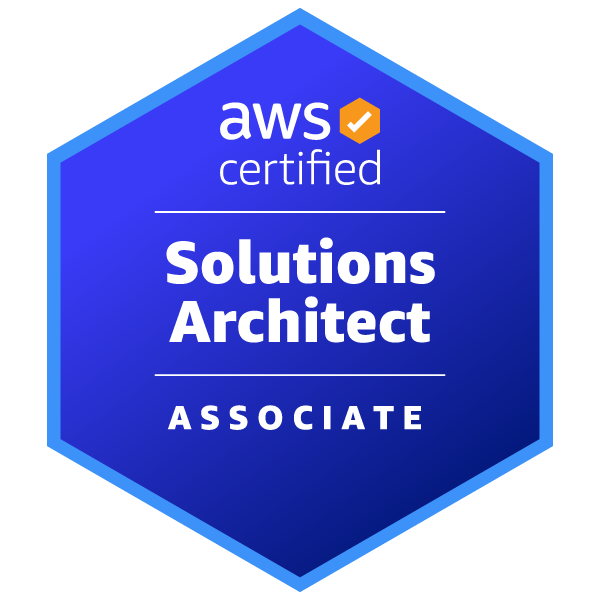
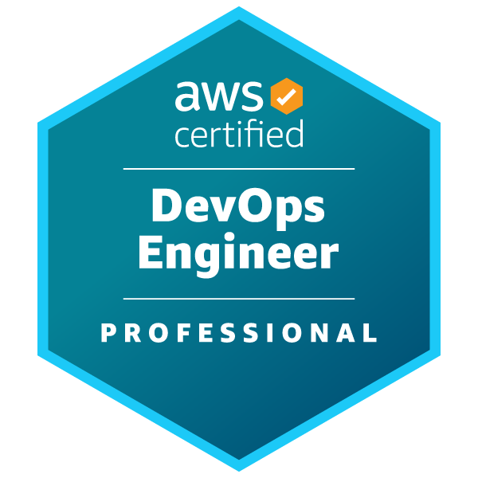
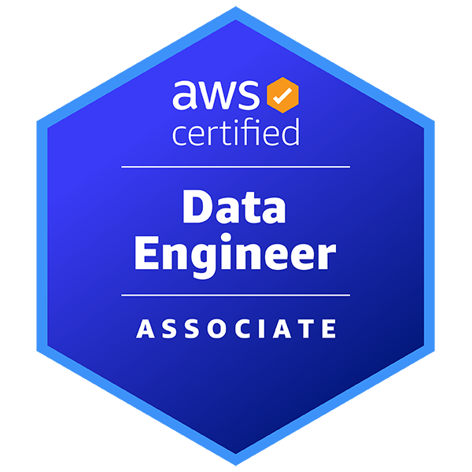

# 👋 Hi, I’m Jakub

**Software Engineer · Data Scientist · Educator & Certified AWS DevOps and Solution Architect**

I believe every problem deserves a **tailored solution** — not templates, not shortcuts. So I design software that is **intentional, measurable, and built to last**.

## 🚀 What I Build

- **Production-grade systems** that scale without drama  
- **Data-driven solutions** that inform real decisions  
- **Cloud-native infrastructure** that is reliable by design  
- **Learning experiences** that turn complexity into clarity  

> Let’s build solutions that actually move the needle.

## 🧠 How I Think

- Strong opinions, loosely held  
- Simple architectures over clever abstractions  
- Performance matters — in systems and in teams  
- Readable code is a competitive advantage  

I treat software as a **craft**, not a race to ship the next feature.

## ⚡ A Small Personal Edge

I enjoy disciplines that reward **focus, endurance, and feedback loops**.  
That mindset shows up in how I write code, review systems, and iterate on ideas.
When I’m not programming, I 🚴.

---

## 🏅 Certifications & Badges

  

  

  

## 📫 Let’s Connect

- **LinkedIn:** [https://www.linkedin.com/in/jkanclerz/](https://www.linkedin.com/in/jkanclerz/) 
- **Open to:** meaningful problems, strong teams, and well-engineered systems  

> *Always consider the context*
